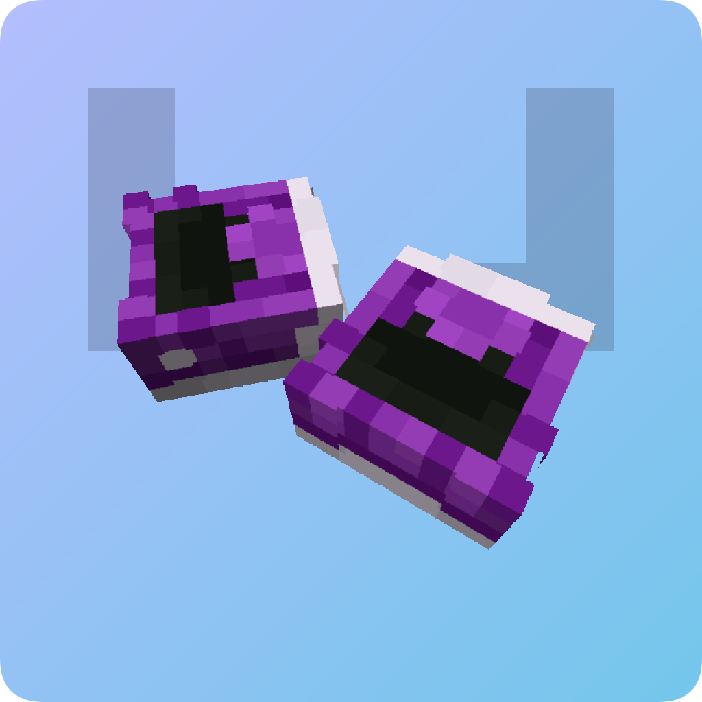
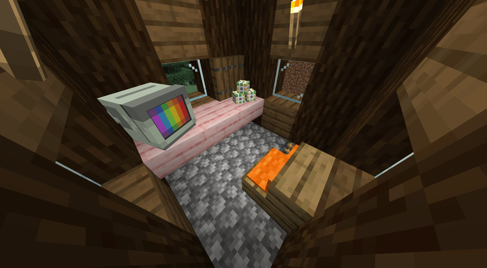

# headmate

Resize, rotate and customize Minecraft heads more than ever before! A PaperMC
plugin. **This requires another plugin (or method) to obtain skinned player
heads to work properly.**

<!-- git-only -->

<!-- /git-only -->

## Controls

headmate uses a [Breeze Rod](https://minecraft.wiki/w/Breeze_Rod) as its wand
item.

To create your first merged head, hold a player head in your offhand and the
wand in your main hand, then click the block you want to place it on. If you
wish to place it inside, hold the Sneak key and click a block. You will now
enter editor mode.

Editor mode features on-screen instructions. In editor mode, you can move,
rotate and scale the head. Press movement keys to move horizontally, or
Jump/Sprint to move vertically. Press Sneak to enter transform mode. In
transform mode, you can rotate and scale the head. Press Forward/Backward to
scale, Left/Right to rotate. Press Sneak to toggle back to move. To save the
change, hold Sneak for a second.

You can add more heads (this is why it's called merged heads!) to the same
block by doing the same thing you did to create the first head.

To edit a head you placed earlier, hold nothing and click the head with the
wand, or shift-click the block to see a list of all the heads in the block. You
can edit or delete heads from this list. You can alternatively delete all heads
in the block by Left-clicking with the wand and a Lava Bucket.

To change the hitbox of the head block, press Left Click while holding the wand.
This will toggle between a pass-through and a solid block. You can also add a
custom block by simply placing it while in pass-through mode.

## Current Issues

- No proper WorldEdit/FAWE support yet
